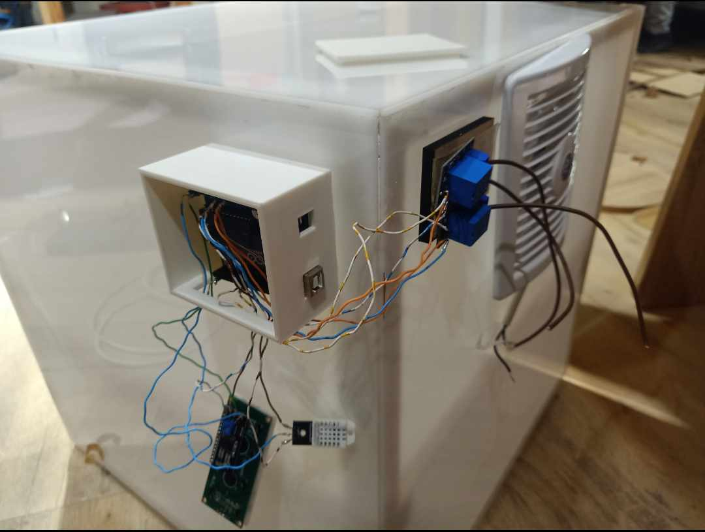

# Hydro-Life

The primary components and their interactions are detailed below:

1. Sensor System:

Temperature and Humidity Sensors:

High-precision sensors are employed to monitor ambient temperature and humidity levels continuously.

Connection to Arduino Uno:

Sensors are intricately connected to the Arduino Uno microcontroller for real-time data acquisition.

2. Arduino Uno:

Data Processing:

The Arduino Uno, a powerful and versatile microcontroller, processes incoming data from the sensors.

LCD Display Integration:

An LCD (Liquid Crystal Display) screen is connected to the Arduino Uno, providing a user-friendly interface for real-time monitoring of temperature and humidity values.

3. Relay Module:

Electrical Control:

A relay module is interfaced with the Arduino Uno to manage electrical devices. It acts as a switch, allowing the microcontroller to control power circuits.

Connection to External Devices:

The relay is linked to external devices, such as power outlets or electrical equipment, enabling the Arduino Uno to regulate their operation based on predefined conditions.

